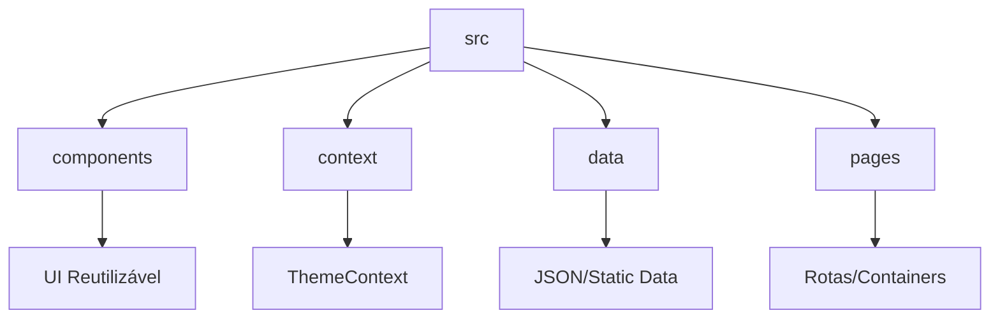

# 🏗️ Arquitetura do Projeto: Cairn Web

Este documento descreve as decisões arquiteturais e os padrões de design adotados no Cairn Web para garantir um código de alta qualidade, manutenível e performático.

## 🎯 Princípios de Design

1. **Separação de Preocupações (SoC)**: A lógica de dados está isolada em `src/data`, os componentes de UI em `src/components` e o estado global de temas em `src/context`.
2. **Imutabilidade e Tipagem Estrita**: O uso de TypeScript garante que as estruturas de dados (Lore, Vocabulário) sejam consistentes em toda a aplicação.
3. **UX Imersiva**: Animações fluidas com Framer Motion e design "Mobile First" garantem que a ferramenta seja prazerosa de usar em qualquer dispositivo.

## 🛠️ Stack Técnica e Motivação

- **React + Vite**: Escolhido pela velocidade de desenvolvimento (HMR ultra-rápido) e ecossistema robusto.
- **Framer Motion**: Utilizado para animações de layout complexas (como a Dynamic Island) que seriam difíceis de manter apenas com CSS puro.
- **Context API**: Gerenciamento de tema centralizado que evita "prop drilling" e garante que a preferência do usuário seja persistida e aplicada instantaneamente.

## 📁 Estrutura de Pastas

## 🧩 Componentes Chave

### Dynamic Island (`src/components/DynamicIsland.tsx`)

- **Padrão**: *Compound Component* (implícito).
- **Responsabilidade**: Navegação e menus de configuração. Utiliza `layout` prop do Framer Motion para transições suaves de tamanho.

### StoryBlock (`src/components/StoryBlock.tsx`)

- **Padrão**: *Render Logic Isolation*.
- **Responsabilidade**: Lógica de tradução "On-Demand". O estado local controla a visibilidade da tradução sem afetar o restante da página.

## 🚀 Próximos Passos de Qualidade

- [ ] Integração de Testes Unitários (Vitest).
- [ ] Otimização de Imagens (WebP).
- [ ] Refinamento de Acessibilidade (ARIA Roles).
